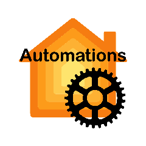

    
    
    <!-- a href="https://github.com/homebridge/homebridge/wiki/Verified-Plugins"></a -->
    
    

  

    
    

# Automations For Homebridge

### Automations For Homebridge is a plugin for Homebridge that provides the ability to create automations in Homebridge.

## <!-- Thin separator line -->
